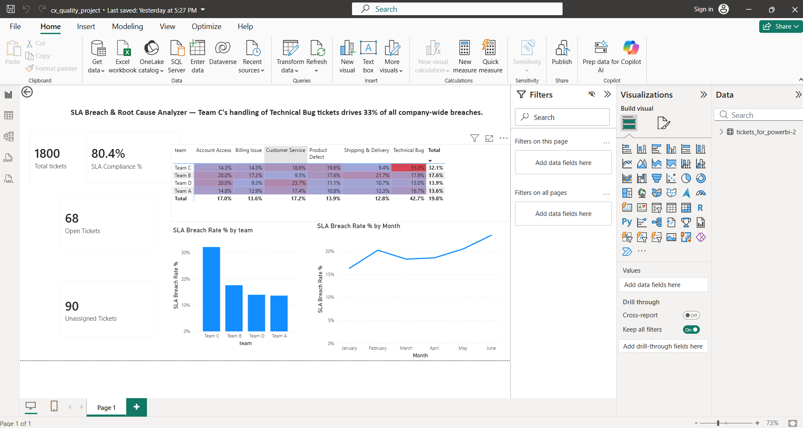

# SLA Breach & Root Cause Analyzer

A SQL → Python → Power BI project built while transitioning from 7+ years in
Quality and Customer Operations into data analytics. It investigates why SLA
compliance is below target in a customer support ticketing system, and
isolates a single, specific, fixable root cause behind a third of all
breaches company-wide.

The investigation approach here — find the metric that's off, segment until
the real driver isolates, quantify its share of the total problem — mirrors
how I worked through real escalation and audit cases in my Quality Analyst
roles, just applied here with SQL, Python, and Power BI instead of Excel.

## The question

*"Why is our SLA compliance below target, and where should we focus first?"*

## The dataset

A synthetic but realistic ticketing dataset: ~1,800 tickets, 60 agents across
4 teams, over a 6-month window. I engineered it myself (`generate_dataset.py`)
rather than using a pre-cleaned public dataset, for two reasons: it let me bake
in a genuine, non-obvious root cause to investigate rather than analyzing
random noise, and it let me deliberately plant realistic data quality issues
(mixed date formats, missing foreign keys, near-duplicate records, logically
impossible timestamps) so the cleaning phase reflects real operational mess
rather than a tidy textbook dataset.

## Tools and workflow

1. **MySQL** — data cleaning and exploratory analysis
2. **Python (pandas, scipy)** — statistical validation and Pareto analysis
3. **Power BI** — interactive dashboard

## Phase 1: Data cleaning (SQL)

See [`01_data_cleaning.sql`](./01_data_cleaning.sql)

| Issue found | How it was handled |
|---|---|
| Inconsistent casing (`high` / `HIGH` / `High`) | Standardized via explicit `CASE` mapping |
| Mixed date formats in the same column | Parsed into clean `DATETIME` columns based on detected format |
| Tickets resolved before they were created | Flagged (`is_logic_error`), excluded only from time-based calculations — not deleted or "corrected," since the true value can't be known |
| Near-duplicate tickets (same details, different ID) | Identified with `ROW_NUMBER()` partitioned across all shared fields, kept earliest ID |
| Missing `agent_id` on ~5% of tickets | Kept as `NULL`, surfaced as its own "Unassigned Tickets" KPI rather than dropped or imputed |

A real ETL issue surfaced during this phase too: ~93 rows silently failed to
import into MySQL because a blank value couldn't cast into an `INT` column.
Caught by comparing row counts before and after import, not by assuming the
import succeeded.

## Phase 2: Statistical validation (Python)

See [`02_python_analysis.py`](./02_python_analysis.py)

- Rebuilt the SQL join independently in pandas — both tools landed on
  identical totals (332 breaches, 33.4% from one team-category combination),
  cross-validating the result rather than trusting a single calculation path.
- Ran a chi-square test of independence to confirm the pattern is real:
  **χ² = 180.10, p < 0.001** — not plausibly due to chance.
- Built a Pareto breakdown across all team × category combinations to confirm
  this wasn't just the worst *rate*, but also the largest *volume* contributor
  to total breaches.

## Phase 3: Dashboard (Power BI)

KPI summary row, team comparison chart, a conditional-formatted team × category
matrix (the heatmap that makes the root cause visible at a glance), and a
monthly breach-rate trend line.

## The finding

> Team C's handling of Technical Bug tickets shows a **55% SLA breach rate** —
> nearly 3x the company average of 19.6% — and despite representing only
> ~12% of total ticket volume, this single team-category combination accounts
> for **33.4% of all SLA breaches company-wide** (χ² = 180.10, p < 0.001).

This reframes the problem from a vague "SLA compliance is low" into a specific,
actionable one: investigate why Team C struggles with Technical Bug tickets
specifically (training gap? tooling issue? understaffing on technical
escalations?) rather than addressing SLA performance company-wide.

## Methodology notes

A few deliberate judgment calls worth flagging, since they came up while
building this:

- **Small-sample noise**: early team × category breakdowns showed several
  team/category cells at 50-100% breach rates — but on inspection, most had
  fewer than 5 tickets. Filtered to combinations with at least 20 tickets
  before drawing any conclusions, so the headline finding is backed by real
  volume (202 tickets), not a fluke.
- **No fabricated corrections**: rows with impossible timestamps were flagged
  and excluded from time-based math, never silently "fixed" with a guessed
  value.
- **Honest axis scaling**: the trend chart's Y-axis is fixed to start at 0%.
  An auto-scaled axis made a modest month-over-month shift look like a cliff.
- **Calibrated trend language**: a recent uptick in monthly breach rate is
  noted as a pattern worth monitoring, not asserted as a confirmed trend —
  six monthly data points isn't enough to rule out normal variation.

## How to reproduce

1. Run `generate_dataset.py` to produce `ticket.csv` and `agent.csv`
2. Load both into MySQL, then run `01_data_cleaning.sql` top to bottom
3. Export the cleaned `ticket` and `agent` tables
4. Run `02_python_analysis.py` (developed in Google Colab) on the exported files
5. Import the resulting `tickets_for_powerbi-2.csv` into Power BI Desktop and
   rebuild the measures documented above
